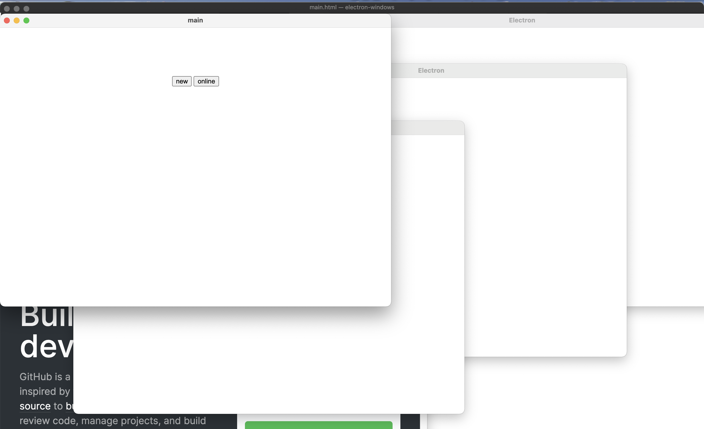

# electron-windows

[![NPM version][npm-image]][npm-url]
[![build status][travis-image]][travis-url]
[![Test coverage][coveralls-image]][coveralls-url]
[![node version][node-image]][node-url]
[![npm download][download-image]][download-url]

[npm-image]: https://img.shields.io/npm/v/electron-windows.svg
[npm-url]: https://npmjs.org/package/electron-windows
[travis-image]: https://api.travis-ci.com/electron-modules/electron-windows.svg?branch=master
[travis-url]: https://travis-ci.com/github/electron-modules/electron-windows
[coveralls-image]: https://img.shields.io/coveralls/electron-modules/electron-windows.svg
[coveralls-url]: https://coveralls.io/r/electron-modules/electron-windows?branch=master
[node-image]: https://img.shields.io/badge/node.js-%3E=_8-green.svg
[node-url]: http://nodejs.org/download/
[download-image]: https://img.shields.io/npm/dm/electron-windows.svg
[download-url]: https://npmjs.org/package/electron-windows

> Manage multiple windows of Electron gracefully and provides powerful features.

<!-- GITCONTRIBUTOR_START -->

## Contributors

|[<br/><sub><b>xudafeng</b></sub>](https://github.com/xudafeng)<br/>|[<br/><sub><b>ColaDaddyz</b></sub>](https://github.com/ColaDaddyz)<br/>|[<br/><sub><b>sriting</b></sub>](https://github.com/sriting)<br/>|
| :---: | :---: | :---: |


This project follows the git-contributor [spec](https://github.com/xudafeng/git-contributor), auto updated at `Tue Dec 07 2021 17:37:08 GMT+0800`.

<!-- GITCONTRIBUTOR_END -->

## Installment

```bash
$ npm i electron-windows --save
```

## Demo



## APIs

### init

```javascript
const WindowManager = require('electron-windows');
const windowManager = new WindowManager();
```

### create

```javascript
const winRef = windowManager.create({
  name: 'window1',
  loadingView: {
    url: '',
  },
  browserWindow: {
    width: 800,
    height: 600,
    titleBarStyle: 'hidden',
    title: 'demo',
    show: false,
    webPreferences: {
      nodeIntegration: app.isDev,
      webSecurity: true,
      webviewTag: true,
    },
  },
  openDevTools: true,
});
```

## TODO

- [ ] support storage of window's size and other configuration
- [ ] clone pointed window

## License

The MIT License (MIT)
