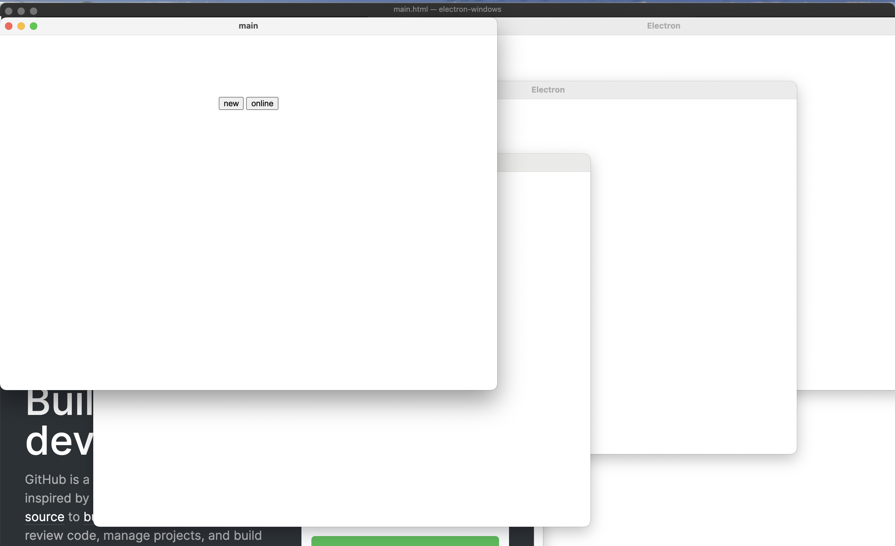

# electron-windows

[![NPM version][npm-image]][npm-url]
[![CI][CI-image]][CI-url]
[![Test coverage][codecov-image]][codecov-url]
[![node version][node-image]][node-url]
[![npm download][download-image]][download-url]

[npm-image]: https://img.shields.io/npm/v/electron-windows.svg
[npm-url]: https://npmjs.org/package/electron-windows
[CI-image]: https://github.com/electron-modules/electron-windows/actions/workflows/ci.yml/badge.svg
[CI-url]: https://github.com/electron-modules/electron-windows/actions/workflows/ci.yml
[codecov-image]: https://img.shields.io/codecov/c/github/electron-modules/electron-windows.svg?logo=codecov
[codecov-url]: https://codecov.io/gh/electron-modules/electron-windows
[node-image]: https://img.shields.io/badge/node.js-%3E=_8-green.svg
[node-url]: http://nodejs.org/download/
[download-image]: https://img.shields.io/npm/dm/electron-windows.svg
[download-url]: https://npmjs.org/package/electron-windows

> Manage multiple windows of Electron gracefully and provide powerful features.

<p align="center"></p>

## Installation

```bash
$ npm i electron-windows --save
```

## Quick Start

```javascript
const WindowManager = require('electron-windows')

// Create a window manager instance
const windowManager = new WindowManager()

// Create a window
const mainWindow = windowManager.create({
  name: 'main',
  browserWindow: {
    width: 800,
    height: 600,
  },
})

// Get window by name
const theWindow = windowManager.get('main')

// Get window by id
const theWindowToo = windowManager.getById(mainWindow.id)

// Get all windows
const all = windowManager.getAll()
```

## API Reference

### Types

- **Window** - A union type of `StatefulWindow` and common `BrowserWindow`. When `storageKey` option is provided, returns `StatefulWindow`; otherwise returns `BrowserWindow`.

### `new WindowManager()`

Creates a new WindowManager instance.

### `windowManager.create(options)`

Creates and manages a new window.

- **options** `Object` - Configuration for the window:
  - **name** `string` - Window identifier, used by `get()`. Default: `'anonymous'`
  - **browserWindow** `Object` - [Electron BrowserWindow options](https://www.electronjs.org/docs/latest/api/browser-window)
  - **loadingView** `Object` - Loading view configuration:
    - **url** `string` - URL to show while main content loads
  - **openDevTools** `boolean` - Auto open DevTools when window is ready. Default: `false`
  - **preventOriginClose** `boolean` - Prevent window from closing, need manually close. Default: `false`
  - **preventOriginNavigate** `boolean` - Prevent webContents navigation. Default: `false`
  - **storageKey** `string` - Save/restore window position and size using `electron-window-state`
  - **storagePath** `string` - Custom storage path for window state file
  - **globalUserAgent** `string` - Custom User-Agent for all `loadURL` calls in this window

Returns: `Window` (`BrowserWindow` or `StatefulWindow`)

### `windowManager.get(name)`

Get a managed window by name.

- **name** `string` - Window name

Returns: `Window | undefined`

### `windowManager.getById(id)`

Get a managed window by Electron window id.

- **id** `number` - Window id

Returns: `Window | undefined`

### `windowManager.getAll()`

Get all managed windows.

Returns: `Object` - Object with window IDs as keys

### `WindowManager.setGlobalUserAgent(ua)`

Static method. Set global user agent for all windows.

- **ua** `string` - User agent string

## Roadmap

- [ ] support storage of window configuration
- [ ] support window cloning

<!-- GITCONTRIBUTOR_START -->

## Contributors

|[<br/><sub><b>xudafeng</b></sub>](https://github.com/xudafeng)<br/>|[<br/><sub><b>sriting</b></sub>](https://github.com/sriting)<br/>|[<br/><sub><b>z0gSh1u</b></sub>](https://github.com/z0gSh1u)<br/>|[<br/><sub><b>snapre</b></sub>](https://github.com/snapre)<br/>|[<br/><sub><b>ColaDaddyz</b></sub>](https://github.com/ColaDaddyz)<br/>|[<br/><sub><b>Copilot</b></sub>](https://github.com/apps/copilot-swe-agent)<br/>|
| :---: | :---: | :---: | :---: | :---: | :---: |
[<br/><sub><b>WynterDing</b></sub>](https://github.com/WynterDing)<br/>|[<br/><sub><b>zlyi</b></sub>](https://github.com/zlyi)<br/>|[<br/><sub><b>moshangqi</b></sub>](https://github.com/moshangqi)<br/>

This project follows the git-contributor [spec](https://github.com/xudafeng/git-contributor), auto updated at `Tue Feb 24 2026 17:35:12 GMT+0800`.

<!-- GITCONTRIBUTOR_END -->

## License

The MIT License (MIT)
